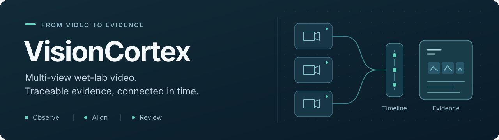
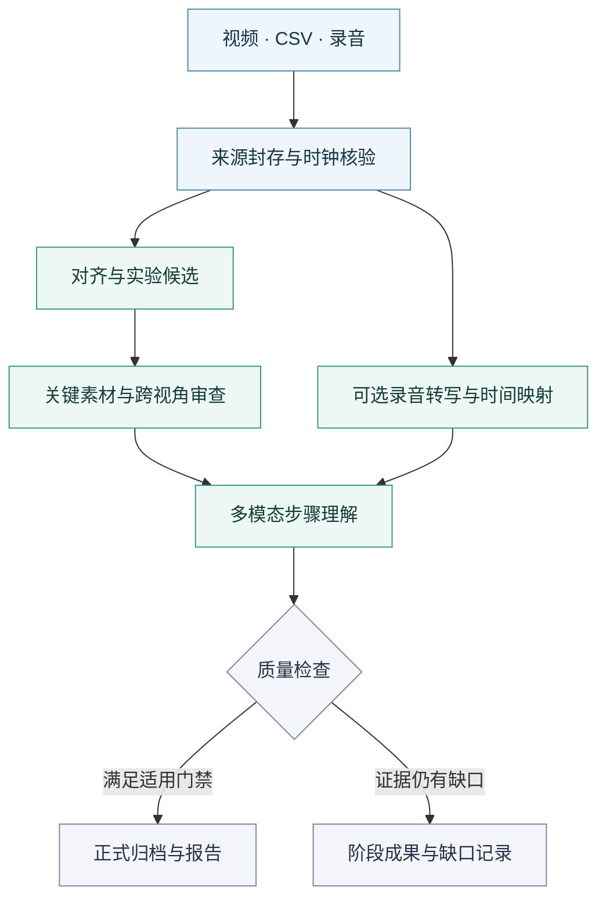

<p align="center">
  
</p>

<p align="center">
  <strong>多视角湿实验视频证据流水线</strong><br>
  从第一人称与第三人称录像，到可回看的实验片段、操作步骤与报告。
</p>

<p align="center">
  <a href="pyproject.toml"></a>
  <a href="#使用方式"></a>
  <a href="docs/DEVICE-DAY-ARCHIVE-CONTRACT.zh-CN.md"></a>
</p>

<p align="center">
  <a href="#核心能力">核心能力</a> ·
  <a href="#快速开始">快速开始</a> ·
  <a href="#产物与追溯">产物与追溯</a> ·
  <a href="#文档导航">文档导航</a> ·
  <a href="#证据与验证">证据与验证</a>
</p>

---

VisionCortex 面向化学与湿实验的长视频分析，将多机位画面、采集时钟和录音组织到
可追溯的实验记录中。它保留从原始媒体、候选事件、跨视角审查，到关键素材、
步骤理解和报告的来源链，让每个结果都能回到对应画面与时间位置。

浏览器上传、离线清单与 NAS 自动采集共用分析核心；研究人员通过页面阅读结果，
工程团队通过 CLI 和 API 接入任务、恢复处理并检索证据。

## 核心能力

| 能力 | 可以做什么 |
| :--- | :--- |
| **多视角时间对齐** | 结合视频与 CSV 时钟，记录逐路可用区间、误差和隔离分片，统一定位第一人称与第三人称画面。 |
| **有界实验发现** | 用检测、跟踪和跨视角审查提出实验候选，保留边界复核、接受理由及未确认区间。 |
| **关键素材与步骤** | 组织动作关键帧、关键片段和事件引用，结合多模态模型生成有来源的步骤理解。 |
| **录音与转写** | 配对原始录音，保存字幕、时间映射与执行回执，支持文字检索、回听和有界重算。 |
| **持久任务与恢复** | 提供分块上传、持久队列、输入封存和校验后的断点恢复，记录阶段进度、耗时与实际 Token 用量。 |
| **归档、检索与报告** | 发布设备日索引、实验素材、日报及 PDF；检索结果可以追溯到源媒体、事件与产物哈希。 |

检测框、分割掩码和模型共识用于构建候选证据；物理动作结论仍须经过适用的审查与质量门。

## 处理流程



这是处理关系示意，跨视角审查按适用输入执行，录音转写可选。
设备日的预处理、索引、多模态理解和日报分别发布状态与回执，
已完成的分片预处理不等待整日理解或报告完成。

## 快速开始

### 1. 克隆并安装

准备 **Git、Python 3.11 或 3.12**。将 `REPOSITORY_URL` 替换为你正在访问的
本仓库克隆地址，创建独立环境后安装基础依赖。

**Linux / macOS**

```bash
git clone "REPOSITORY_URL" VisionCortex
cd VisionCortex
python3.11 -m venv .venv
source .venv/bin/activate
python -m pip install -e .
```

**Windows PowerShell**

```powershell
git clone "REPOSITORY_URL" VisionCortex
cd VisionCortex
py -3.11 -m venv .venv
.\.venv\Scripts\python.exe -m pip install -e .
```

使用 Python 3.12 时，将创建环境命令中的 `3.11` 换成 `3.12`。
基础安装提供本地页面，不安装 PyTorch、CUDA、YOLO 或 TensorRT，也不需要 API 密钥。
开发检查再用同一环境的 Python 安装 `".[dev]"`；详细命令与故障排查见
[本地启动指南](docs/guides/local-development.zh-CN.md)。

### 2. 检查并打开页面

**Linux / macOS**

```bash
./start-visioncortex.sh --check-only
./start-visioncortex.sh
```

**Windows PowerShell**

```powershell
.\Start-VisionCortex.bat -CheckOnly
.\Start-VisionCortex.bat
```

Windows 也可双击 `Start-VisionCortex.bat`；macOS 可双击 `Start-VisionCortex.command`。
启动后打开 **[http://127.0.0.1:8000/#/home](http://127.0.0.1:8000/#/home)**。
端口被占用时，使用 `--port 8010`（Windows：`-Port 8010`）。

默认使用 [development-local.yaml](configs/development-local.yaml)，关闭 NAS 自动采集与
多模态调用；仓库附带的空采集索引不包含实验记录。首次页面用于查看功能和配置，
真实视频分析需要另行配置模型、权重、FFmpeg 与所选服务，见
[交付手册](docs/VisionCortex-端到端视频分析交付手册.md)。使用管理员已部署的服务时，按
[普通用户 10 分钟操作指南](docs/VisionCortex-普通用户10分钟操作指南.md)提交任务。

<details>
<summary>可选：生成结构与契约示例</summary>

```bash
visioncortex dry-run --config configs/development-local.yaml --output outputs/dry-run
```

`dry-run` 使用合成数据验证目录、JSON 契约和评估结构，不能证明真实模型调用或实验准确率。

</details>

## 使用方式

| 入口 | 适用场景 | 从这里开始 |
| :--- | :--- | :--- |
| **Web 工作台** | 上传录像、选择采集批次、查看进度、回看步骤与素材 | [用户指南](docs/VisionCortex-普通用户10分钟操作指南.md) |
| **CLI** | 使用视频与时钟清单，固定配置运行或复验档案 | [输入清单](examples/manifest.example.yaml) · [操作参考](docs/FEATURES-AND-OPERATIONS.zh-CN.md#输入清单) |
| **机器 API** | 跨机认证提交、范围隔离、幂等恢复与结果查询 | [机器 API 与 GPU worker](deployment/inference/README.md) |
| **后台采集** | 接收已就绪的采集分片，独立推进设备日处理与发布 | [设备日运维总览](docs/DEVICE-DAY-OPERATIONS-OVERVIEW.zh-CN.md) |

已预配主机的自动处理服务包、局域网账号与 HTTPS、本机 AI 服务设置和独立体验实例，
集中在[功能与操作参考](docs/FEATURES-AND-OPERATIONS.zh-CN.md)。

## 产物与追溯

### NAS 自动采集：设备日五目录

```text
<日期>_<设备>/
├── MetaVideo/                  原视频、原录音与采集元数据
├── ProcessedClips/             活动片段、动作关键帧与场景采样
├── MultimodalUnderstanding/    理解结果、画面引用与模型回执
├── LaboratoryDailyReport/      同一设备同一天的日报
└── Comment/                    备注、protocol 与实际录音转写
```

目录拼写与 v1 语义由[设备日归档契约](docs/DEVICE-DAY-ARCHIVE-CONTRACT.zh-CN.md)
和 [JSON Schema](docs/contracts/device-day-v1.schema.json) 固定。
`key_frames` 保留给五类物理动作的选定事件；无活动区间使用 `scene_frames`，
不会以普通场景抽帧充当动作关键帧。录音及 STT 保留在实际设备、实际日期下。

### 离线多视角实验

既有实验入口保留 `Experiment-Clips`、`JSON-Config-Files`、`Key-Materials`、
`Lab-Daily-Reports` 与 `Professional-PDFs` 布局，完整结构见[产出参考](docs/FEATURES-AND-OPERATIONS.zh-CN.md#产出)。
两种入口共用分析与来源追溯逻辑，保留各自归档契约及历史读取兼容。

产物记录源文件身份、时间范围、事件引用及 SHA-256。检索索引由归档数据派生，
可以重建；阶段成果保留质量缺口和版本记录，供后续回看与恢复。

## 文档导航

| 目标 | 文档 |
| :--- | :--- |
| **使用已部署服务** | [10 分钟操作指南](docs/VisionCortex-普通用户10分钟操作指南.md) |
| **安装与交付** | [端到端交付手册](docs/VisionCortex-端到端视频分析交付手册.md) · [后台服务安装](deployment/rtx3090ti-ubuntu/README.md#web-lifecycle) |
| **配置与功能细节** | [功能与操作参考](docs/FEATURES-AND-OPERATIONS.zh-CN.md) |
| **开发结构与全部文档** | [文档导航](docs/README.md) · [模块职责](docs/reference/architecture.zh-CN.md) |
| **采集与设备日处理** | [运维总览](docs/DEVICE-DAY-OPERATIONS-OVERVIEW.zh-CN.md) · [原位预处理](docs/NAS-INPLACE-PREPROCESSING.zh-CN.md) · [LabVideo](docs/LAB-VIDEO-MONITORING.zh-CN.md) |
| **任务、检索与恢复** | [统一任务与检索契约](docs/UNIFIED-TASK-RETRIEVAL-CONTRACT.md) · [运行层](docs/UNIFIED-RUNTIME-WORK.md) · [阶段恢复](docs/STAGE-RECOVERY.md) |
| **模型与人工标注** | [标注与训练](docs/PROJECT-ANNOTATION-TRAINING.zh-CN.md) · [框真值契约](docs/YOLO-Box-Ground-Truth-and-Annotation-Contract.zh-CN.md) |
| **真实运行与验收** | [验收单模板](docs/VisionCortex-交付验收单模板.md) |
| **RTX 4060 部署** | [安装与运行说明](deployment/rtx4060/README.md) |

## 证据与验证

阅读结果时，以对应运行的回执和证据等级为准：

| 标记 | 含义 |
| :--- | :--- |
| `PROVEN` | 指定范围的结论有对应、可复查的证据支持。 |
| `PARTIAL_EVIDENCE` | 已保留阶段成果，但仍存在明确的质量或覆盖缺口。 |
| `NOT_PROVEN` | 尚缺少支持该项结论的适用证据。 |

确定性测试、合成界面示例、实际模型调用、真实视频质量、浏览器交付和正式发布资格
分别验证。每次交付使用[验收单](docs/VisionCortex-交付验收单模板.md)记录固定源码 SHA、
配置、实际回执和已知限制；既有运行结果不代表任意新版本已完成验收。

采集原片的软链接替换受独立验证门禁约束，不能直接删除视频、录音或 CSV；
具体边界见[设备日归档契约](docs/DEVICE-DAY-ARCHIVE-CONTRACT.zh-CN.md)。

## 开发与参与

修改前阅读[模块职责](docs/reference/architecture.zh-CN.md)，核对相关代码、配置和契约。
模型、引擎、原始媒体、运行产物及密钥放在受控的外部存储中。

在已配置的开发环境中，可以运行针对性检查，例如：

```bash
python -m pytest tests/test_unified_runtime.py
git diff --check
```

提交时说明变更范围、检查结果与证据边界。真实运行使用固定源码 SHA、已核验的
环境和输入清单；执行节点规则以相应任务书为准。
