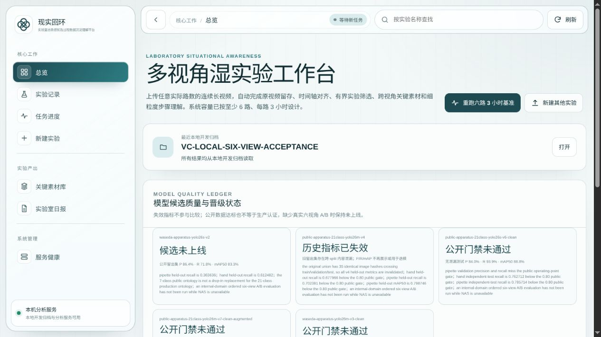
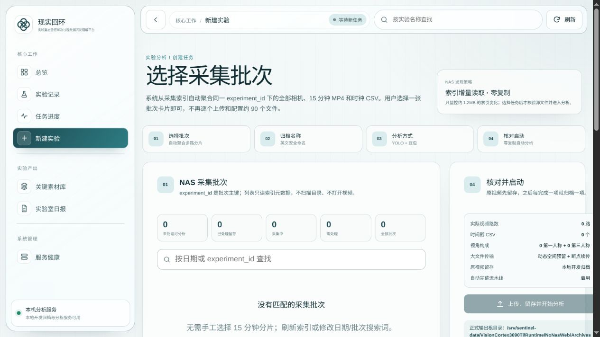
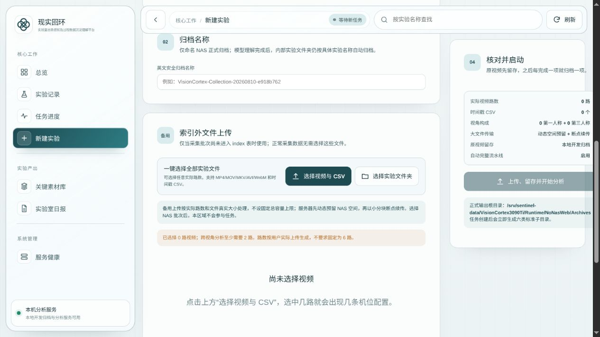
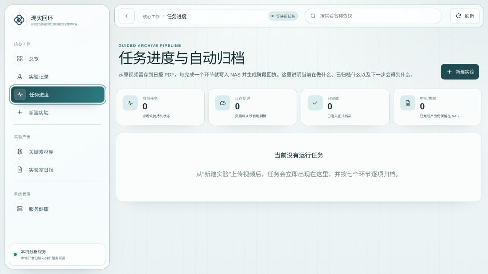
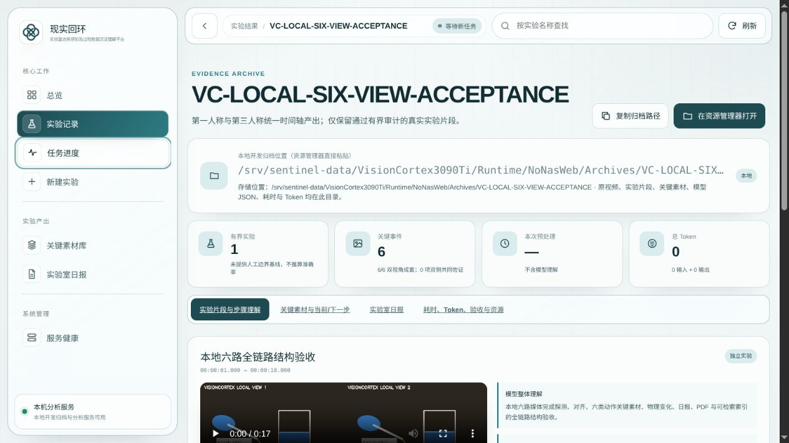
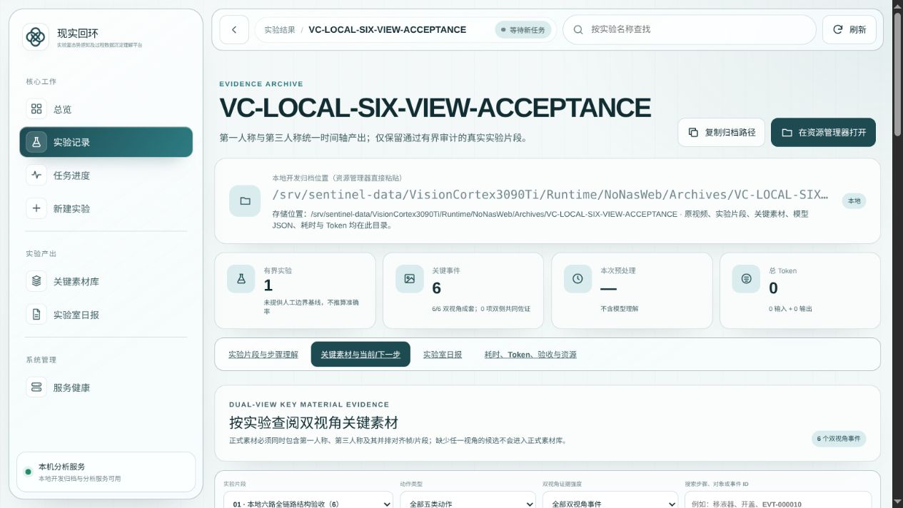
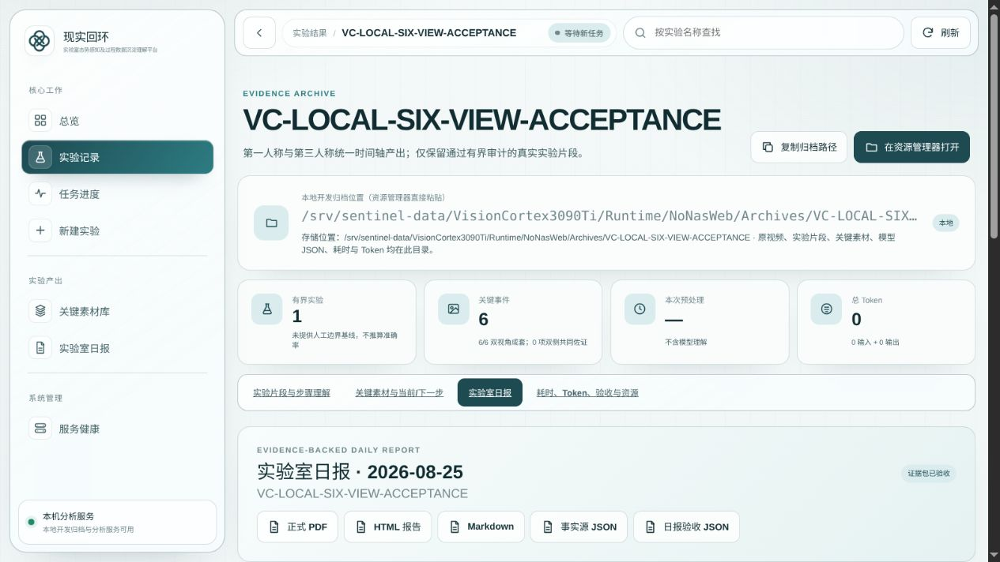
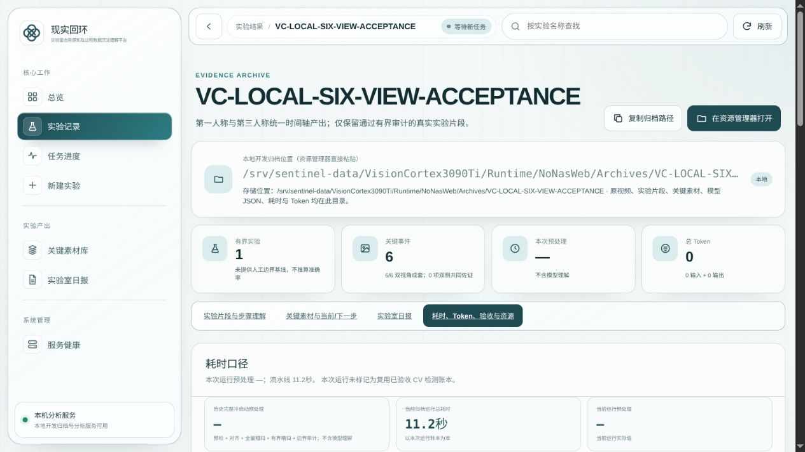

# VisionCortex 普通用户 10 分钟操作指南

> 适用对象：第一次使用 VisionCortex 提交湿实验视频分析的普通用户<br>
> 目标：从打开网页到提交任务，并知道完成后去哪里验收结果<br>
> 不包含：服务器安装、模型部署、NAS 运维和生产升级

## 开始前只确认三件事

向管理员取得局域网地址、用户名 `visioncortex` 和登录密码。然后确认：

- 页面显示的是 **NAS 正式归档**，不是“本地开发归档”。
- 服务状态是 `NAS 可用`，不是 `NAS 不可用`。
- MLLM/豆包模型显示已启用，任务页没有生产门禁错误。

任一条件不满足就停止提交并联系管理员。网页能打开不等于生产分析链路可用。

> 本页截图来自本地合成验收环境，只用于帮助你识别页面和按钮。截图中的本地归档、
> 合成数据、0 Token 或 MLLM 未启用，不是生产通过证据。

## 1. 登录并确认首页

用 Chrome、Edge、Firefox 或 Safari 打开管理员提供的：

```text
http://<3090Ti局域网IP>:8000/#/home
```

输入用户名 `visioncortex` 和管理员线下提供的密码。不要把密码写进任务名称、截图、
工单或聊天记录。

登录后首页会显示工作台、最近归档和模型状态。先确认生产状态，再点“新建实验”。



## 2. 优先选择 NAS 采集批次

已由采集系统写入 NAS 的视频，优先使用“采集批次”入口：

1. 点击“新建实验”。
2. 选择对应批次，确认它已封口且状态为 `ready_to_analyze`。
3. 核对实验时间、机位数、分片数，并确认角色同时包含第一人称和第三人称。
4. 填写英文安全归档名，只用英文字母、数字、下划线、点或连字符。
5. 在最终确认区看到“源视频复制 0 字节”和“自动完整流水线启用”后提交。

系统会直接读取 NAS 分片的虚拟时间轴，不会重复复制或拼接原片。



## 3. 只有索引外数据才上传

如果本次数据不在 NAS 采集索引中：

1. 一次性选择全部视频和可选 CSV，或选择包含它们的文件夹。
2. 为每路视频填写唯一机位 ID，并选择“第一人称”或“第三人称”。
3. 把时间戳 CSV 映射到正确机位；没有 CSV 就留空。
4. 确认所有文件属于同一次实验，并至少有一路第一人称和一路第三人称。
5. 核对总文件数、总字节数、归档名和容量预留，再开始分析。



服务器按默认 16 MiB 分块续传。网络中断后，重新选择**完全相同**的文件即可继续；
不要创建同名新任务。文件名、大小、最后修改时间或断点内容不同，服务器会拒绝续传。

## 4. 保存任务信息并等待

提交成功立即记录：

```text
任务 ID：
归档名称：
提交时间：
提交人：
输入方式：NAS 采集批次 / 浏览器上传
```

在“任务进度”页观察状态：

- `queued`：正常排队；3090 Ti 同时只跑一个正式 GPU 任务。
- `running`：正在处理；不要刷新后重复提交。
- `completed`：可以进入结果验收。
- `failed`：记录任务 ID 和错误，联系管理员；不要自行降低门槛重试。



系统会依次完成预检与对齐、实验发现、实验片段、关键素材、证据验收、日报/PDF。
服务重启后等待任务会恢复；执行中任务由同一任务身份恢复，用户不要再建一份。

## 5. 验收实验视频和关键素材

只有最终状态为 `completed` 才开始验收。在“实验视频”页逐个检查：

- 实验边界是否合理；
- 第一人称、第三人称和并排对齐视频是否都能播放；
- 多视角中同一动作的时间是否一致。



在“关键素材”页抽看关键帧和关键片段，核对动作、参与对象、当前步骤、下一步骤以及
不确定项。系统标记为未知、遮挡或冲突的内容必须保留不确定性。



## 6. 验收报告、质量和 Token

在“实验室日报”中打开 JSON 事实、Markdown、HTML、人工复核表和 PDF，确认报告与
视频证据一致，文件都能打开。



在“质量与性能”中确认：

- 证据包验收和日报验收均为通过；
- 有完整阶段耗时和运行总耗时；
- 正式豆包调用有真实输入、输出和总 Token，不能用估算值；
- 关键素材覆盖和不确定项数量符合实际，不以事件多为“质量好”。



## 完成标准

下面各项全部满足，用户侧流程才算完成：

- [ ] 任务状态为 `completed`。
- [ ] 每个接受实验都有三种对齐视频且可播放。
- [ ] 关键素材有双视角证据，未知/遮挡/冲突未被改写成确定事实。
- [ ] 证据包验收与日报验收均通过。
- [ ] JSON、Markdown、HTML、复核表和 PDF 均可打开。
- [ ] 正式模型调用的真实 Token 和阶段耗时可查看。
- [ ] 已把任务 ID、归档名和发现的问题交给验收人员登记。

## 常见问题

| 现象 | 你应该做什么 |
| --- | --- |
| 显示本地开发归档、NAS 不可用或 MLLM 未启用 | 停止提交，联系管理员切换并修复生产服务 |
| 反复要求登录 | 核对用户名 `visioncortex`，让管理员检查密码文件 |
| HTTP 403 | 接入受信局域网/VLAN，不要尝试从公网访问 |
| HTTP 503 | 联系管理员检查生产预检和服务状态 |
| 上传返回 507 | 容量预留不足；等待管理员释放经批准的空间 |
| 长时间 `queued` | 正常等待，不要重复提交 |
| 上传中断 | 重新选择完全相同的文件继续 |
| 对齐失败 | 检查是否混入不同实验、角色或 CSV 映射错误 |
| 关键事件为 0 或较少 | 查看筛选说明和不确定项，不要要求降低质量门槛 |
| 任务 `failed` | 记录任务 ID、错误和时间，交管理员定位后再决定是否重试 |

需要部署、运维或文件级验收时，继续阅读
[端到端视频分析交付手册](VisionCortex-端到端视频分析交付手册.md)。正式签字使用
[交付验收单模板](VisionCortex-交付验收单模板.md)。
