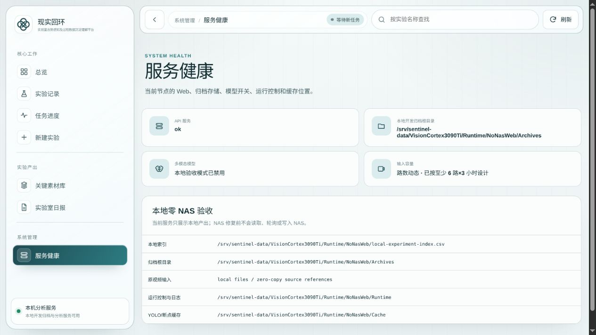

# VisionCortex 端到端视频分析交付手册

> 适用对象：3090 Ti 服务器管理员、实验视频分析用户、结果验收人员<br>
> 推荐入口：受信局域网内的 VisionCortex 3090 Ti Web 服务<br>
> 生产配置：`configs/rtx3090ti-ubuntu-production.yaml`<br>
> 文档版本：2026-09-03

本手册从服务器交付、视频准备、任务提交、运行观察一直覆盖到结果验收。普通分析
用户只需要浏览器；安装、模型、CUDA、NAS 和密钥由服务器管理员一次性准备。

## 文档导航

| 你要做什么 | 使用哪份文档 |
| --- | --- |
| 第一次提交并查看结果 | [普通用户 10 分钟操作指南](VisionCortex-普通用户10分钟操作指南.md) |
| 部署、日常运维、排障、升级 | 本手册 |
| 正式交付验收、签字 | [交付验收单模板](VisionCortex-交付验收单模板.md) |
| 查看已记录的真实六路运行口径 | [历史真实六路验收示例](VisionCortex-历史真实六路验收示例.md) |

页面截图来自本地合成验收环境，只用于识别界面。截图中的“本地开发归档”、
`MLLM 未启用` 或 `NAS 不可用` 都是**停止生产提交**的信号，不是生产状态示范。

## 1. 先明确三种运行结论

| 结论 | 能证明什么 | 不能证明什么 |
| --- | --- | --- |
| `PROVEN` | 当前步骤有对应运行回执或验收文件 | 不自动外推到未执行的真实数据 |
| `PARTIAL_EVIDENCE` | 部分门禁已通过，但仍缺真实模型、真实视频或人工真值之一 | 不能宣称正式生产质量已通过 |
| `NOT_PROVEN` | 尚未执行或缺少必要回执 | 不能用网页可打开、HTTP 200 或合成结果代替 |

`run-local-acceptance` 使用合成六路视频，只验证媒体、结构、索引、报告、PDF 和模型
工件预检链路。正式结论必须来自生产配置下的真实视频运行、真实模型调用、豆包
Token 账本和质量验收回执。

## 2. 一页执行清单

### 服务器管理员

- [ ] 生产机是 Ubuntu 22.04、RTX 3090 Ti 24 GiB，项目路径为
  `/home/x1/Projects/VisionCortex`。
- [ ] NAS 已挂载到 `/home/x1/桌面/nas`，索引、归档和缓存目录都存在且可写。
- [ ] 两套 21 类闭集 YOLO 源权重已放到规定路径，所有公共模型已完成哈希校验。
- [ ] 固定 Python 环境、CUDA、TensorRT 和 FFmpeg 检查通过。
- [ ] Ark 密钥文件及 Web 密码文件由当前用户持有，权限均为 `600`。
- [ ] 生产模型认证回执存在、通过且未因模型或真值变化而失效。
- [ ] 六路合成交付链通过；正式投产前的真实 GPU 模型验收通过。
- [ ] LAN 服务状态显示 `health=ok`、`storage_mode=nas`、`nas_available=True`、
  `mllm_enabled=True`、`ark_key_configured=True`、`queue_persistence=sqlite`。

### 视频分析用户

- [ ] 至少有一路第一人称和一路第三人称视频，所有机位属于同一次实验。
- [ ] 已优先确认数据是否在 NAS 采集批次索引中；在索引中就不重复上传。
- [ ] 每个机位角色、视频和可选时间戳 CSV 映射正确。
- [ ] 提交后记下任务 ID 和归档名称；`queued` 是正常排队，不是失败。
- [ ] 任务最终显示 `completed`，证据包验收和日报验收均通过。
- [ ] 已检查对齐实验视频、关键素材、不确定项、日报/PDF、耗时和 Token。

## 3. 输入数据要求

一次任务必须满足以下要求：

1. 至少两路视频，并且角色集合同时包含 `first_person` 和 `third_person`。
2. `view_id` 必须唯一，只使用英文字母、数字、下划线、点或连字符。
3. 浏览器支持选择 MP4、MOV、M4V、MKV、AVI、WebM 和 CSV。正式运行前应确认
   FFprobe 能读取每个视频，视频不是零字节，也没有截断。
4. 时间戳 CSV 是可选项，但多机位存在独立时钟时强烈建议提供。一个 CSV 只能映射
   给一个机位。
5. 所有机位应覆盖同一次实验，并有足够重叠时间。角色标错、跨实验混放或时钟严重
   漂移会触发对齐/质量门禁，而不是被系统静默猜测。
6. NAS 采集系统产生的 15 分钟分片应走“采集批次”入口。该入口从索引构造虚拟
   时间轴，原视频复制量为 0；不要把每个分片在上传页误当成独立机位。
7. 上传任务没有固定路数、时长或总 GB 上限，但服务器会按真实文件大小、处理预留、
   安全余量和其他活动任务预留做动态容量检查。容量不足时任务不会开始。

## 4. 3090 Ti 服务器首次交付

以下步骤只由服务器管理员执行。普通用户从第 6 节开始。

### 4.1 固定代码与目录

```bash
cd /home/x1/Projects/VisionCortex
git status --short --branch
git rev-parse HEAD
```

工作树必须干净，实际 SHA 必须是已审核、已通过 CI 和所需真实视频门禁的冻结 SHA。
不要在生产任务运行时切换提交，也不要在 4060 冻结执行节点上进行开发或调参。

确认以下已有目录，不要用空目录替代失联 NAS：

```text
/home/x1/桌面/nas/experiment_record_index.csv
/home/x1/桌面/nas/VisionCortexExperimentArchive
/home/x1/桌面/nas/VisionCortexExperimentArchive/.VisionCortex-Run-Staging
/home/x1/桌面/nas/VisionCortexExperimentCache
/srv/sentinel-data/VisionCortex3090Ti
```

### 4.2 放置闭集模型并安装固定环境

先按 `configs/models/closed-set-yolo.json` 提供两套源权重：

```text
/srv/sentinel-data/VisionCortex3090Ti/Models/ClosedSetYOLO/first_person/best.pt
/srv/sentinel-data/VisionCortex3090Ti/Models/ClosedSetYOLO/third_person/best.pt
```

然后执行安装。安装器会固定依赖、校验模型哈希并在本机生成 TensorRT engine；
`.engine` 不能从其他 GPU 机器直接复制。

```bash
cd /home/x1/Projects/VisionCortex
export VISIONCORTEX_PYTHON='/home/x1/anaconda3/envs/gaoqing/bin/python'
./deployment/rtx3090ti-ubuntu/01-Install-And-Validate.sh --skip-api-key-check
```

### 4.3 安全配置 Ark 密钥

不要把密钥写进 Git、YAML、命令参数、聊天、截图或日志。下面的输入不会把密钥值
写进 shell 历史：

```bash
install -d -m 700 /home/x1/.config/VisionCortex
IFS= read -r -s -p 'Ark API key: ' VISIONCORTEX_ARK_INPUT; printf '\n'
umask 077
printf '%s\n' "$VISIONCORTEX_ARK_INPUT" > /home/x1/.config/VisionCortex/ark_api_key
chmod 600 /home/x1/.config/VisionCortex/ark_api_key
unset VISIONCORTEX_ARK_INPUT
```

### 4.4 生产预检

```bash
cd /home/x1/Projects/VisionCortex
export VISIONCORTEX_PYTHON='/srv/sentinel-data/VisionCortex3090Ti/.venv/bin/python'
./deployment/rtx3090ti-ubuntu/00-Preflight.sh --production
```

只有最后输出 `preflight=passed` 才能继续。任何 `failure=` 都必须先解决；不要通过
改小门槛、创建假 NAS 目录或关闭模型门禁来绕过。

### 4.5 跑交付前验收

先跑不访问 NAS、不开豆包的六路合成结构验收。输出目录必须是新目录：

```bash
cd /home/x1/Projects/VisionCortex
acceptance_root="/srv/sentinel-data/VisionCortex3090Ti/Runtime/LocalAcceptance/$(date +%Y%m%d-%H%M%S)"
/srv/sentinel-data/VisionCortex3090Ti/.venv/bin/python -m labvision_evidence \
  run-local-acceptance \
  --output "$acceptance_root" \
  --config configs/rtx3090ti-ubuntu-local.yaml
```

合成验收的 `JSON-Config-Files/local_acceptance.json` 必须同时满足
`status=completed` 和 `passed=true`。它仍然只是结构证据。

如公共人工标注样本已经准备好，再执行真实 GPU 模型连通验收：

```bash
/srv/sentinel-data/VisionCortex3090Ti/.venv/bin/python -m labvision_evidence \
  accept-local-models \
  --dataset /srv/sentinel-data/VisionCortex3090Ti/Runtime/PublicDatasets/LabPicsChemistry/extracted \
  --output /srv/sentinel-data/VisionCortex3090Ti/Runtime/Model-Quality/acceptance-$(date +%Y%m%d-%H%M%S) \
  --config configs/rtx3090ti-ubuntu-local.yaml
```

这一步真实调用本地生产 CV 模型，但不访问 NAS、不调用豆包，也不能替代真实湿实验
质量认证。生产配置还要求以下认证回执存在且有效：

```text
/srv/sentinel-data/VisionCortex3090Ti/Runtime/Model-Quality/production_model_certification.json
```

若认证缺失、未通过、模型哈希变化或认证输入指纹过期，正式任务应 fail-closed。

### 4.6 安装 LAN 服务

```bash
cd /home/x1/Projects/VisionCortex
./deployment/rtx3090ti-ubuntu/07-Install-LAN-Server.sh
./deployment/rtx3090ti-ubuntu/08-Server-Status.sh
```

首次安装会无回显地要求设置两次 Web 密码，用户名固定为 `visioncortex`。保存安装器
输出的局域网 URL。服务仅允许回环和私有局域网地址，并对每条路由执行 Basic Auth。

LAN 服务目前是 HTTP，不会加密口令和视频流量。只能在受信有线网络/VLAN 中使用；
禁止路由器端口转发或直接暴露公网。需要跨不受信网络访问时，应先单独交付 HTTPS、
身份认证、限流和审计方案。

## 5. 每日开机检查

管理员在用户提交任务前执行：

```bash
cd /home/x1/Projects/VisionCortex
./deployment/rtx3090ti-ubuntu/08-Server-Status.sh
```

生产服务至少应显示：

```text
health=ok
storage_mode=nas
nas_available=True
mllm_enabled=True
ark_key_configured=True
queue_persistence=sqlite
upload_protocol=resumable_chunks_v1
upload_fixed_total_size_limit=False
```

下面的截图是本地合成环境的反例：它证明网页能显示服务信息，但其中
`storage_mode=local_development`、`mllm_enabled=false`、`nas_available=false` 表示
不能提交生产任务。正式环境必须满足上面的生产状态清单。



`queue_waiting` 大于 0 表示有任务排队；`gpu_job_active=True` 表示 GPU 正在处理任务。
这两项不是故障。如果状态检查失败，先看：

```bash
systemctl --user --no-pager --full status visioncortex-lan.service
journalctl --user -u visioncortex-lan.service -n 200 --no-pager
```

日志可以用于定位错误，但不得复制或打印 Ark 密钥、Web 密码或原始视频内容。

## 6. 普通用户：提交一次完整分析

第一次使用建议直接跟随[普通用户 10 分钟操作指南](VisionCortex-普通用户10分钟操作指南.md)。
本节保留完整文字流程，便于离线查阅和管理员排障。

### 6.1 登录

1. 使用 Chrome、Edge、Firefox 或 Safari 打开管理员提供的
   `http://<3090Ti局域网IP>:8000/#/home`。
2. 用户名输入 `visioncortex`，密码由管理员线下提供。
3. 页面应显示 NAS 正式归档，而不是“本地开发归档”。如果看到本地开发模式，停止
   提交并联系管理员。

### 6.2 优先选择 NAS 采集批次

1. 点击“新建实验”。
2. 如果本次数据已经进入采集索引，选择对应批次。
3. 确认页面显示批次已封口、`ready_to_analyze`，并核对路数、片段数、第一/第三
   人称角色和实验时间。
4. 输入英文安全归档名称。
5. 在最终确认区检查“源视频复制 0 字节”和“自动完整流水线启用”。
6. 点击开始分析。

这是正式推荐路径：系统直接读取 NAS 分片虚拟时间轴，不复制或拼接原片。

### 6.3 索引外文件上传

只有数据不在采集索引中时才使用上传：

1. 点击“选择视频与 CSV”一次性选中全部文件，或选择包含它们的文件夹。
2. 每路视频填写唯一机位 ID，并选择“第一人称”或“第三人称”。
3. 把时间戳 CSV 映射给对应机位；没有 CSV 时保留为空。
4. 确认至少一路第一人称和一路第三人称，路数和文件大小符合预期。
5. 输入英文安全归档名称，检查最终确认区后点击开始分析。

服务器会先做动态空间预留，通过后按默认 16 MiB 分块上传，并在全部分块到达后对
每个文件计算完整 SHA-256。3090 Ti 生产配置只在 NAS 归档中留一份原片。

如果网络中断：

1. 不要创建同名新任务；保留当前页面，直接再次点击可继续。
2. 页面刷新或浏览器重启后，重新选择完全相同的文件，再次提交。
3. 文件名、大小、最后修改时间和断点处内容必须与原文件一致；系统会拒绝把不同
   文件拼接到旧断点。
4. 连续 7 天无进度的未完成上传会话会过期并清理；已进入队列的任务不会因此过期。

### 6.4 记录任务信息

提交成功后记录：

```text
任务 ID：
归档名称：
提交时间：
提交人：
输入方式：NAS 采集批次 / 浏览器上传
源实验 ID（如有）：
```

## 7. 运行期间怎么看

进入“任务进度”页。系统每次只执行一个正式 GPU 任务，其余任务显示 `queued`。
队列和页面状态保存在：

```text
/srv/sentinel-data/VisionCortex3090Ti/Runtime/state/web_run_queue.sqlite3
```

用户会依次看到以下七个业务环节：

1. 原视频留存：保存 NAS 原片或确认零复制索引输入。
2. 预检与时间对齐：探测媒体、建立多机位全局时间轴。
3. 有界实验发现：运动探针、粗扫、精扫和边界审计。
4. 实验片段：生成第一人称、第三人称和并排对齐视频。
5. 关键素材：生成关键帧、关键片段、时间戳和参与对象证据。
6. 证据验收：检查跨视角证据、结构、媒体、索引和不确定项。
7. 日报与 PDF：使用已验收事实确定性生成，不新增模型 Token。

不要因为长时间停留在粗扫、精扫或模型理解阶段就重复提交。页面同时显示逐视角
进度、GPU/NVDEC、CPU、内存、I/O、模型调用和 Token；超过 20 秒未更新时页面会
提示数据可能延迟，而不会自行宣称任务已经停止。

服务或主机意外重启后，等待中的任务会自动恢复；执行中的任务会在租约过期后以
同一任务身份重新进入执行器，并复用校验通过的分块和模型账本。恢复前不要再次创建
同一实验。只有任务明确进入 `failed` 且错误已定位后，才决定重试。

## 8. 结果验收与交付

### 8.1 浏览器验收

任务必须最终显示 `completed`。按归档依次检查：

1. “实验视频”：每个接受实验都有第一人称、第三人称和并排对齐视频，边界合理。
2. “关键素材”：逐事件查看对齐关键帧/片段、动作、对象、当前步骤、下一步骤和
   不确定项；缺少双视角的候选不应进入正式素材库。
3. “质量与性能”：查看证据包验收、关键素材覆盖、运行总耗时、各阶段耗时、模型
   执行/复用次数和输入/输出/总 Token。
4. “实验室日报”：核对 JSON 事实、Markdown、HTML、人工复核表和正式 PDF。
5. 对模型标记为未知、遮挡或冲突的内容保留不确定性，不得人工改写成确定事实。

### 8.2 文件级验收

正式归档位于：

```text
/home/x1/桌面/nas/VisionCortexExperimentArchive/<归档名称>
```

至少核对以下文件：

| 文件/目录 | 验收要求 |
| --- | --- |
| `JSON-Config-Files/pipeline_status.json` | `stage` 为 `completed` |
| `JSON-Config-Files/Stage-Receipts/*.json` | 实际执行阶段均有完成回执 |
| `JSON-Config-Files/evidence_package.json` | 权威证据包存在 |
| `JSON-Config-Files/evidence_package_eval.json` | `passed` 为 `true` |
| `JSON-Config-Files/run_metrics.json` | 有阶段耗时；正式豆包调用有真实 Token 用量 |
| `JSON-Config-Files/final_key_material_annotation.json` | 有最终框、复核决策、预算和不确定项 |
| `Experiment-Clips/` | 有接受实验的三种对齐视频/sidecar |
| `Key-Materials/` | 有关键帧、关键片段、时间戳和模型理解 |
| `JSON-Config-Files/evidence_index.sqlite` | 可查询索引存在，JSON 仍是权威数据 |
| `JSON-Config-Files/daily_report_manifest.json` | `passed` 为 `true` 且含各报告校验和 |
| `Lab-Daily-Reports/<日期>/Daily-Report-Eval.json` | `passed` 为 `true` |
| `Professional-PDFs/` | 正式证据 PDF 存在且可打开 |

管理员可用以下只读命令快速检查核心门禁，把 `<归档名称>` 替换为实际值：

```bash
archive='/home/x1/桌面/nas/VisionCortexExperimentArchive/<归档名称>'
jq -e '.stage == "completed"' "$archive/JSON-Config-Files/pipeline_status.json"
jq -e '.passed == true' "$archive/JSON-Config-Files/evidence_package_eval.json"
jq -e '.passed == true' "$archive/JSON-Config-Files/daily_report_manifest.json"
jq -e '.tokens.run_total.total_tokens != null' "$archive/JSON-Config-Files/run_metrics.json"
find "$archive/Professional-PDFs" -maxdepth 1 -type f -name '*.pdf' -size +0c -print
```

以上命令全通过仍不替代人工抽看：至少抽查时间对齐、实验边界、关键动作参与对象框、
双视角一致性和报告文字是否忠实表达不确定性。

### 8.3 交付内容

对外交付时保留整个归档目录，不要只复制 PDF。建议同时登记：

```text
代码 SHA：
生产配置：configs/rtx3090ti-ubuntu-production.yaml
任务 ID：
源实验 ID：
归档名称和绝对路径：
完成时间：
证据包验收：通过 / 未通过
日报验收：通过 / 未通过
模型认证回执 SHA-256：
人工抽查人和时间：
遗留不确定项：
```

正式交付请复制并填写[交付验收单模板](VisionCortex-交付验收单模板.md)，不要只在聊天
中回复“已通过”。历史真实六路耗时和 Token 示例见
[历史真实六路验收示例](VisionCortex-历史真实六路验收示例.md)；该示例仅证明当时
记录的运行，不自动证明当前代码、机器或模型。

## 9. 常见问题处理

| 现象 | 含义 | 处理 |
| --- | --- | --- |
| 浏览器反复要求登录 | 用户名/密码错误，或密码文件不可用 | 确认用户名为 `visioncortex`；管理员检查文件所有者和 `600` 权限 |
| HTTP 403 | 客户端不在允许的私有网段 | 接入受信 LAN/VLAN；不要放开到公网 |
| HTTP 503 | Web 访问配置无效，或服务启动门禁失败 | 查看 systemd 状态和日志，修复配置后重启 |
| 页面显示本地开发归档 | 启动了本地服务而非生产 LAN 服务 | 停止提交，管理员切回 `visioncortex-lan.service` |
| NAS 批次不可选 | 批次未封口、索引不可读或质量门未过 | 修复采集索引/批次状态，不要绕过 `ready_to_analyze` |
| 上传返回 507 | 动态容量预留不足 | 清理经过批准的 NAS 空间或等待其他任务释放预留；不要改小安全余量 |
| 上传中断 | 网络或浏览器中断 | 重新选择完全相同文件，从服务器确认的字节位置续传 |
| 长时间 `queued` | 前面有 GPU 任务 | 正常等待；管理员用状态脚本确认队列和活动任务 |
| 模型认证缺失/过期 | 生产质量门禁未满足 | 由模型负责人重新用独立真值认证；禁止关闭门禁 |
| Ark 密钥错误/额度问题 | 豆包模型调用无法完成 | 管理员安全更新密钥或账户状态；不要把密钥贴进工单 |
| 对齐失败 | 视频不属同一实验、时钟/CSV 错误或重叠不足 | 修正输入映射后新建任务；保留失败回执用于审计 |
| 关键事件为 0 或较少 | 可能确实无可确认动作，也可能被质量门拒绝 | 查看筛选说明和不确定项；不得为凑数量降低门槛 |
| 任务 `failed` | 某个 fail-closed 门禁或运行阶段失败 | 记录任务 ID、错误和 staging 路径；先定位，再决定同身份恢复或新任务 |

## 10. 停机、升级和回退

1. 先运行 `08-Server-Status.sh`，确认没有 `gpu_job_active=True` 的任务。
2. 记录当前 `git rev-parse HEAD`、队列状态和所有未完成任务 ID。
3. 只同步已审核的冻结 SHA；不要在生产机临时改代码、rebase 或 cherry-pick。
4. 升级后重新执行生产预检、相关确定性测试、六路合成验收和所需真实视频门禁。
5. 再启动 LAN 服务并跑状态检查。模型、配置或认证输入发生变化时，旧认证回执不能
   自动沿用。
6. 需要回退时切回先前记录的完整冻结 SHA，并同时恢复与该 SHA 匹配的配置、模型
   注册表和认证回执；不要只回退单个源文件。

人工停止和重新启动服务：

```bash
systemctl --user stop visioncortex-lan.service
systemctl --user start visioncortex-lan.service
./deployment/rtx3090ti-ubuntu/08-Server-Status.sh
```

等待队列和分块上传状态保存在本地 SQLite 中；正式原片和产出在 NAS。不要手工编辑
SQLite、阶段回执或权威 JSON 来改变任务状态。

## 11. 明确禁止事项

- 不把 Ark 密钥、Web 密码、模型文件、TensorRT engine、原视频或运行产出提交到 Git。
- 不把 3090 Ti 生成的 `.engine` 复制到其他 GPU 并宣称可用。
- 不在任务运行期间拉代码、切分支、停止 Web、卸载 NAS 或修改生产参数。
- 不把合成验收、HTTP 200、网页可打开或单元测试通过描述为真实视频质量通过。
- 不把 YOLO-World、Grounding DINO、SAM2、LabPics 或伪标签单独当作物理动作真值。
- 不删除不确定项，不为达到事件数量而降低阈值，不绕过生产模型认证。
- 不将当前 HTTP LAN 服务直接发布到互联网。

## 12. 参考资料

- `README.md`：项目能力、模型链和输出契约。
- `docs/VisionCortex-普通用户10分钟操作指南.md`：带截图的最短用户路径。
- `docs/VisionCortex-交付验收单模板.md`：正式验收记录和签字模板。
- `docs/VisionCortex-历史真实六路验收示例.md`：历史真实运行数据与证据边界。
- `deployment/rtx3090ti-ubuntu/README.md`：3090 Ti 安装与运行边界。
- `docs/DUAL-REPOSITORY-RELEASE-POLICY.md`：两个平级仓库的同步规则及正式构建要求。
- `docs/Key-Event-Ground-Truth-Contract.md`：关键事件真值合同。
- `docs/YOLO-Box-Ground-Truth-and-Annotation-Contract.zh-CN.md`：参与对象框真值合同。
- `docs/RTX4060-Codex-真实六路全链路执行任务书.md`：4060 冻结节点专项任务书。
- `docs/RTX4060-真实六路运行回传模板.md`：4060 真实运行回传格式。
